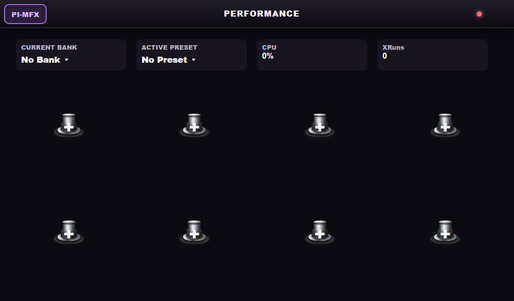

# Pi-MFX

**An original guitar multi-effects pedalboard for the Raspberry Pi 5.**

Pi-MFX turns a dedicated, headless Raspberry Pi 5 into a low-latency guitar
processor: an in-process LV2 effect chain (including NAM captures and cabinet
impulse responses) driven from a touchscreen, tablet, phone, or PC browser,
with an optional DIY footswitch controller you build and wire yourself.



- **Lowest latency is the point.** Direct ALSA `hw:` mmap access from one
  realtime thread. No JACK, no PipeWire, no extra process hop.
- **Your audio hardware.** USB class-compliant interfaces and I2S audio HATs
  are both first-class.
- **No floorboard required.** A browser on the LAN is a complete control surface.
- **Build any controller you can wire.** Switches, pots, sliders, expression
  pedals, encoders, and optional LEDs — mapped in the UI, not hardcoded in
  firmware.

Anyone on the same local network or hotspot can open the UI and control the Pi.
There is no login on the LAN HTTP or WebSocket APIs.

## Documentation

| | |
| --- | --- |
| [User guide](docs/USER_GUIDE.md) | How to use every screen |
| [Screenshots](docs/SCREENSHOTS.md) | Every view at 1024×600 (7" LCD) |
| [Features](docs/FEATURES.md) | What Pi-MFX does |
| [Install](docs/INSTALL.md) | First Pi, audio HAT, kiosk, hotspot |
| [Development](docs/DEV_FLOW.md) | PC edit → Pi rebuild loop |
| [Technical](docs/TECHNICAL.md) | Engine, UI, firmware, data files |
| [Low latency](docs/LOW_LATENCY.md) | OS tuning and round-trip |
| [DIY controller](docs/DIY_CONTROLLER.md) | ESP32-S3 floorboard |
| [Controller protocol](docs/CONTROLLER_PROTOCOL.md) | USB-MIDI SysEx |
| [License](LICENSE) · [Notice](NOTICE.md) | MIT, credits |
| [Third-party](docs/THIRD_PARTY.md) · [Plugin licenses](docs/PLUGIN_LICENSES.md) | Linked libraries and LV2 |

## Hardware

| Part | Notes |
| --- | --- |
| Raspberry Pi 5 | Dedicated to Pi-MFX. Headless Raspberry Pi OS 64-bit. |
| Audio interface | USB class-compliant **or** an I2S HAT (HiFiBerry, Audio Injector, IQaudIO, …). Needs a real instrument input. |
| Display | Optional 7" 1024×600 touchscreen for kiosk mode. Any browser works instead. |
| Foot controller | Optional. ESP32-S3 DevKit + your switches/pots/LEDs. See [docs/DIY_CONTROLLER.md](docs/DIY_CONTROLLER.md). |

Pi 5 has no analog audio output and HDMI is not a guitar path, so an interface
or HAT is required.

## Install

On the Pi (the repo is private; clone with SSH):

```bash
git clone git@github.com:MegaNoob75/Pi-MFX.git
cd Pi-MFX
sudo bash ./scripts/pimfx.sh
```

Then open `http://pimfx.local:8080` (or `http://<pi-address>:8080`) from any
browser on the network. Full instructions, including audio HAT overlays and
kiosk mode, are in [docs/INSTALL.md](docs/INSTALL.md).

To pull `dev`, rebuild, and restart later: **Settings → System → Updates**,
`sudo bash ./scripts/pimfx.sh update` on the Pi, or **`pimfx.cmd` item 3** from
Windows. Day-to-day editing from a PC is described in
[docs/DEV_FLOW.md](docs/DEV_FLOW.md) (double-click `pimfx.cmd`; login is stored
only in gitignored `.pimfx-remote`).

## License

MIT — see [LICENSE](LICENSE). Credits and third-party notices are in
[NOTICE.md](NOTICE.md).
